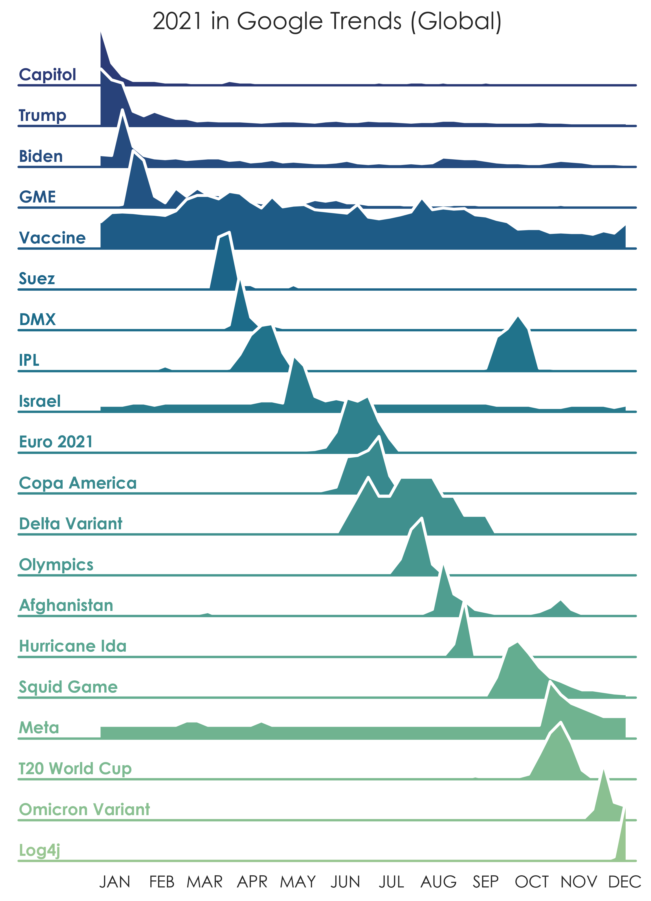

# year-in-search-trends: Visualization of search interest over time

[](https://opensource.org/licenses/MIT)
[](https://github.com/psf/black)
---

**year-in-search-trends** is just [pytrends](https://github.com/GeneralMills/pytrends) and seaborn's [FacetGrid](https://seaborn.pydata.org/generated/seaborn.FacetGrid.html) with some extra steps.
The keywords are preselected and normalized to visualize different orders of magnitude of search interest in the same chart.

## Usage
#### Get source code and dependencies
```sh
git clone https://github.com/joweich/year-in-search-trends.git
cd year-in-search-trends
pip install -r requirements.txt
```
#### Minimal example
```python
import yearinsearchtrends as yist

keywords = ["happening1", "happening2"]
df = yist.get_interest_over_time(
    keywords, "2022-01-01 2023-01-01", geo="DE"
)
yist.ridgeplot(df)
```

## Data source
Data is retrieved from https://www.google.com/trends. You have to comply with Google's [Terms of Service](https://support.google.com/trends/answer/4365538?hl=en) if you use this data source. Neither [pytrends](https://github.com/GeneralMills/pytrends) nor this project are officially supported tools.

## Example


## Miscellaneous
- [Search category lookup](https://github.com/pat310/google-trends-api/wiki/Google-Trends-Categories)
- [Country code lookup](https://en.wikipedia.org/wiki/List_of_ISO_3166_country_codes)